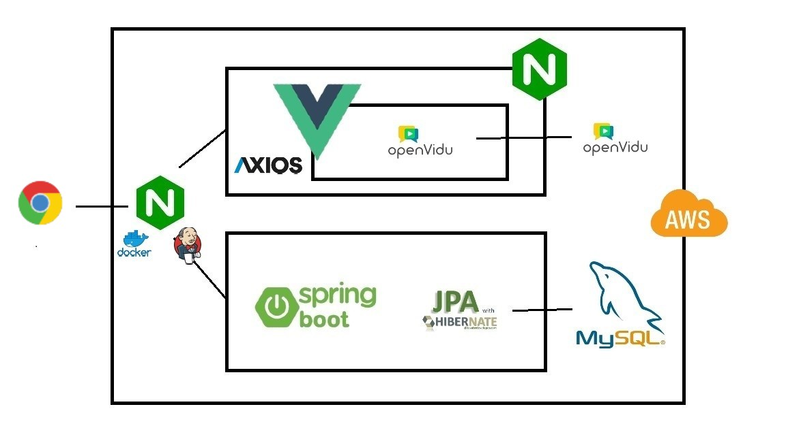

# 🔖모두의 책갈피

## 📖프로젝트 소개

* 프로젝트명: 모두의 책갈피

* 서비스 특징

  실시간으로 도서 정보를 검색 or 공유할 수 있는 웹 사이트, 개인의 독서 의욕을 높이기 위한 시스템을 만들기 

- 주요 기능 
  1. 도서정보 API(국립중앙도서관 등의 API)를 활용하여 도서정보를 활용
  2. 화상회의 생성 시  도서 정보 출력 및 썸네일 이미지로 활용하여 특정 도서에 대한 접근성을 확보
  3. 프로필에 각자 읽은 도서목록 업데이트 
  4. 독서마라톤 챌린지
  5. 나의 책갈피
  6. 베스트셀러 추천 및 신간도서 추천

* 주요 기능
  - 회원 관리
  - 화상 미팅룸

* 주요 기술
  - WebRTC

  - JWT Authentication

  - REST API

    

## 프로젝트 상세 설명

#### 개발환경

- OS : Windows 10
- Server : AWS EC2
  - Ubuntu 20.04.1
  - Docker 20.10.12
- Backend
  - Java : Java 1.8.0
  - Framework : SpringBoot 2.4.5
  - ORM : JPA(Hibernate)
  - Nginx : 1.18.0 (Ubuntu)
  - IDE : Intellij 2021.1.3 / Visual Studio Code 1.59
  - Dependency tool : gradle-6.9.2
  - Database : MySQL 8.0
- Frontend - HTML5, CSS3, Javascript(Es6) - Vue 3.0.0 - @vue/cli 4.5.0 - Vuex 4.0.0 - Vue-axios 3.2.4

#### 기술 스택 

#### 시스템 구성도

#### ERD

#### 핵심기능
- Landing page

- 신간도서 및 베스트셀러 추천 페이지

- 프로필, 독서마라톤 및 책갈피 조회

- 독서모임 리스트

- 화상회의

